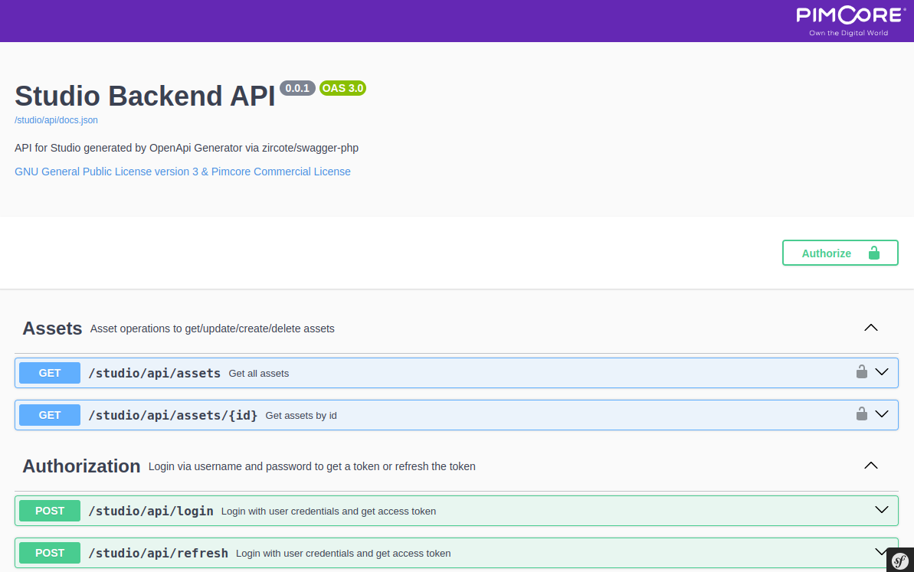

# Pimcore Studio Backend

The Pimcore Studio Backend serves as the central hub for API endpoints and RPC calls. 
It provides a unified interface based on the OpenApi Specification for all backend calls which is accessible via swagger-ui.

It uses [zircote/swagger-php](https://github.com/zircote/swagger-php) attributes to generate the OpenApi Specification.

Swagger-ui is available at `/studio/api/docs` and the OpenApi Specification is available at `/studio/api/docs.json`.

## Documentation Overview

- [Installation](./doc/01_Installation.md)

- [Grid](./doc/03_Grid.md)
