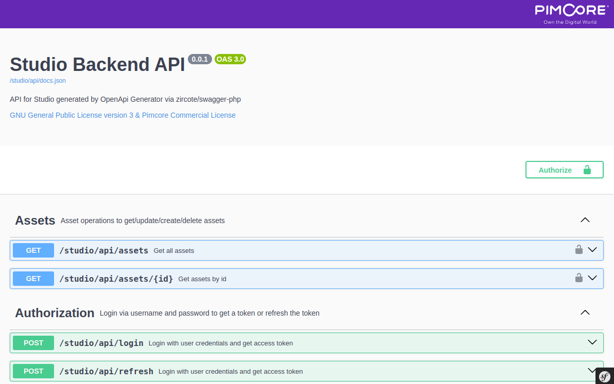

# Pimcore Studio Backend

The Pimcore Studio Backend serves as the central hub for API endpoints and RPC calls. 
It provides a unified interface based on the OpenApi Specification for all backend calls which is accessible via swagger-ui.

It uses [zircote/swagger-php](https://github.com/zircote/swagger-php) attributes to generate the OpenApi Specification.

Swagger UI is available at `/pimcore-studio/api/docs` in the `dev` environment, and the OpenApi Specification (JSON) is available at `/pimcore-studio/api/docs/json`.
Every description is translatable and can be found in the `studio_api_docs.en.yaml` file of the bundle.

## Requirements
This bundle requires the following dependencies:

* Pimcore Core Framework 12
* Generic Execution Engine as part of the Pimcore Core Framework
* Generic Data Index
* Mercure (https://mercure.rocks)

## Features in a Nutshell

- OpenAPI-documented REST API for all Pimcore operations (assets, data objects, documents)
- Real-time updates via Mercure (Server-Sent Events)
- Extensible architecture: custom endpoints, filters, grid columns, document types
- Grid system with configurable columns, filters, and data transformers
- Generic Execution Engine integration for background task processing
- GDPR data extraction support
- Perspective and widget system for UI customization
- Comprehensive event system for customization hooks

## Documentation Overview

- [Architecture Overview](./doc/01_Architecture_Overview/README.md)
- [Installation and Configuration](./doc/02_Installation_and_Configuration/README.md)
- [Extending](./doc/03_Extending/README.md)
- [Development Details](./doc/04_Development_Details/README.md)

## Contribute
**Bug fixes:** please create a pull request including a step by step description to reproduce the problem  
**Contribute features:** contact the core-team via issue before you start developing   
**Security vulnerabilities:** please see our [security policy](https://github.com/pimcore/pimcore/security/policy)

For details, please have a look at our [contributing guide](https://github.com/pimcore/studio-backend-bundle/blob/2026.x/CONTRIBUTING.md).
